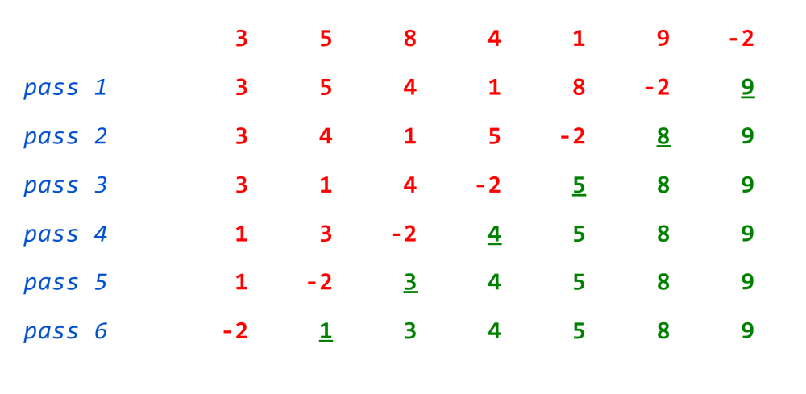

# Sorting (Part 1)

>Note: The most of the information of these lectures was extracted and adapted from Dr Bajuelos and from Weiss’s book, “Data Structures and Algorithm Analysis in Java". They are provided for COP3530 students only. Not to be published or publicly distributed without permission by the publisher. 

Sorting – one of the principles of algorithm design. Sorting used as a subroutine in many of the in many of the algorithms.

Sorting is ordering a list of objects. 

Two types of sorting: 

* Internal sorting - if the number of objects is small enough to fits into the main memory; 

* External sorting - if the number of objects is so large that some of them reside on external storage during the sort. 

## Sorting Applications  

* Searching - Binary search lets you test whether an item is in a dictionary/array in O(log n) time.
* Closest pair problem* - Given n numbers, find the pair which are closest to each other. Once the numbers are sorted, the closest pair will be next to each other in sorted order, so an O(n) linear scan completes the job.
* Duplicates? - Given a set of n items, are they all unique or are there any duplicates? Sort them and do a linear scan to check all adjacent pairs. This is a special case of closest pair above.

## Method

To determine order, we can use the compareTo method that we know must be available for all Comparables. 

Example, find the maximum of an array.
```java
	public static Comparable findMax( Comparable[] arr )
	{
	 	int maxIndex = 0;
	 	for( int i = 1; i < arr.length; i++ )
		    if( arr[i].compareTo( arr[maxIndex] ) > 0 )
	                         maxIndex = i;	
	             return arr[maxIndex];
	}
```

## Sorting
>The Main Problem 

Assume we have n comparable elements in an array and we want to rearrange them to be in increasing order.

Input:
* An array A of n comparable records
* A key value in each data record
* A comparison function (consistent and total)

Output:

Reorganize the elements of A such that:
 * if i < j then A[i] < A[j]

## Insertion Sort 

Main idea: 

At step k, put the kth element in the correct position among the first k elements

Alternate way of saying this:
* Sort first two elements
* Now insert 3rd element in order
* Now insert 4th element in order
* . . .

The insert operation means:
* Insert the element A[i] into sorted array A[0: i-1] by pairwise swap down to the correct position 


```java
public static <AnyType extends Comparable<? super AnyType>>
         void insertionSort( AnyType [] a )
{
	int j;
	for( int p = 1; p < a.length; p++ )
	{
	    AnyType tmp = a[p];
           for( j = p; j > 0; j-- )
                if (tmp.compareTo( a[j - 1] ) >= 0)	// Comparison
                    break;
                else
		a[j] = a[j - 1];			// Flip or Inversion
           a[j] = tmp;
        }
}

```

* In insertion sort elements are inserted into the sorted section, while in bubble sort the maximums are bubbled out of the unsorted section.


### Insertion Sort. Analysis 

Best-case: O(n)  

Worst-case: O(n<sup>2</sup>)  

Average-case: O(n<sup>2</sup>)

## Selection Sort
Main idea: 

At step k, find the smallest/largest element among the not-yet-sorted elements and put it at position k

Alternate way of saying this:
* Find smallest element, put it 1st
* Find next smallest element, put it 2nd
* Find next smallest element, put it 3rd …


```java
public static void swapReferences(Comparable[] a, int ind1, int ind2)
{
        int tmp = a[ind1];
        a[ind1] = a[ind2];
        a[ind2] = tmp;
}
public static void selectionSort(Comparable[] A )
{
    int i;
    for( i = A.length-1; i > 0; i-- ) {
       // find maximum value in A[0..i]
       int maxIndex = 0;
       int j;
       for( j = 1; j <= i; j++ ) {
	  /*  inner loop invariant: for all k < j, A[maxIndex] >= A[k]  */
	  if (A[maxIndex].compareTo(A[j]) < 0 )
	      maxIndex = j;
       }
       /*  swap largest (A[maxIndex]) into A[i]  */
       swapReferences( A, i, maxIndex );
    }
  }

```

### Selection Sort. Analysis 

Best-case: O(n<sup>2</sup>)  

Worst-case: O(n<sup>2</sup>)  

Average-case: O(n<sup>2</sup>)


# Insertion  vs.  Selection Sort 

Two different algorithms to solve the same problem.

They have the same worst-case and average-case asymptotic complexity.

Insertion-sort has better best-case complexity; preferable when input is “mostly sorted”.

Insertion-sort may do well on small arrays.

Some Animations:

Insertion Sort
> https://www.youtube.com/watch?v=ROalU379l3U

Selection Sort
> https://www.youtube.com/watch?v=Ns4TPTC8whw

## Shell Sort (also called - “Gap” sort) 

Shell sort is a generalization of insertion sort, with two observations in mind:

* Insertion sort is efficient if the input is "almost sorted".
* Insertion sort is inefficient, on average, because it moves values just one position at a time.

Is more like a segmented insertion sort.

Shell Sort is easy to develop an intuitive sense of how this algorithm works, but is very difficult to analyze its running time complexity.

Main ideas:

* Divide an array into several smaller non-contiguous segments. 
* The distance between successive elements in one segment is called a gap.
* Each segment is sorted within itself using insertion sort.
* Then re-segment into larger segments (smaller gaps) and repeat (insert) sort.
* Continue until only one segment (gap = 1).
* When the gap = 1, Shell Sort is equal to Insertion Sort 
    * It will be able to work very fast, since Insertion Sort is fast when the array is almost in order.

## Example 

Initial Gap = 4


Gap = 2


Gap = 1


## Shell Sort. 
>### Gap sequence  

Important points:

* The sequence h<sub>1</sub>, h<sub>2</sub>, h<sub>3</sub>,…, h<sub>t</sub> is a sequence of increasing integer values which will be used as a sequence (from right to left) of gap values.
* Any sequence will work as long as it is increasing and h<sub>1</sub>=1.
* For any gap value hk we have A[i] ≤ A[i + h<sub>k</sub>]
* Best practical results are obtained when all values in the gap sequence are relatively prime (sequence does not share any divisors).

Three Methods (for the gap sequence):
* Shell's suggestion - first gap is n/2 - successive gaps are previous value divided by 2.
* Odd gaps only - like Shell method except if division produces an even number add 1. 
* 2.2 method - like Odd gaps method (add 1 to even division result) but use a divisor of 2.2 and truncate. Best performance of all - most nearly a relatively prime sequence.

Visualization:
https://www.youtube.com/watch?v=CmPA7zE8mx0 

http://www.cs.usfca.edu/~galles/visualization/ComparisonSort.html


## HeapSort

Heap sort is a comparison based sorting technique based on Binary Heap data structure. 

Remember that… 

A binary min-heap has:

* Structure property: A complete binary tree – binary tree that is completely filled, with the possible exception of the bottom level, which is filled from left to right. 
* (min) Heap property: the key of a node <= the keys of the children


### HeapSort
> Algorithm 

Input:
* Unsorted array A[1..n]

Algorithm: 
* BuildHeap
    * for (i=0; i < A.length; i++)
        * B[i]=insert(A[i])
* Sort procedure
    * for (i=0; i <B.length; i++)
        * A[i]=deleteMin()
Output:
Sorted array A[1..n]

Algorithm Analysis:

insert() and deleteMin() are O(logn) then the overall running time of HeapSort is O(nlogn)

### Implementation

Java implementation (Author: Mark Weiss)
https://users.cs.fiu.edu/~weiss/dsj2/code/Sort.java

Visualization (in-place version)
https://www.cs.usfca.edu/~galles/visualization/HeapSort.html

## HeapSort vs Shell Sort

O(nlogn) vs O(n<sup>1.5</sup>) ???

n<sup>1.5</sup> grow faster that nlogn so Heapsort is more efficient than Shell sort.


## Summary and preliminary results:


| Algorithm  | Stable?  | Best Time  |  Average Time | Worst Time  | Extra Memory |
|---|---|---|---|---|---|
| Selection Sort | no | O(N<sup>2</sup>)  | O(N<sup>2</sup>)  |  O(N<sup>2</sup>) |  O(1) |
| Insertion Sort | yes | O(N) | O(N<sup>2</sup>)  |  O(N<sup>2</sup>)  |  O(1) |
| Shellsort  | no | O(N*LogN) | O(N<sup>1.25</sup>)*  |  O(N<sup>1.5</sup>)* | O(1)  |
| Heapsort  | no |O(N)  | O(N*logN)  |  O(N*logN) | O(1)  |

*Estimation

Stable sorting algorithm – mean that the algorithm preserves the input order of equal elements in the sorted output. 

Selection Sort – non-stable. Example: 4,2,3,4,1

HeapSort – non-stable. Example: 2,1,2


## Class Problem

Bubble sort is a stable, in-place sorting algorithm named for smaller or larger elements “bubble” to the top of the list. Although the algorithm is simple, it is too slow and impractical for most problems even compared to insertion sort, and is not recommended for large input.

The only significant advantage that bubble sort has over most other implementations, even Quicksort, but not insertion sort, is the ability to detect if the list is already sorted. When the list is already sorted (best-case), bubble sort runs in linear time.


How Bubble Sort works?

Each pass of bubble sort steps through the list to be sorted compares each pair of adjacent items and swaps them if they are in the wrong order. At the end of each pass, the next largest element will “Bubble” up to its correct position. 

These passes through the list are repeated until no swaps are needed, which indicates that the list is sorted. In the worst-case, we might end up making an n-1 pass, where n is the input size.




How we will implement it?

```java
import java.util.Arrays;
 
class Main
{
    // Utility function to swap values at two indices in the array
    public static void swap(int[] arr, int i, int j)
    {
        int temp = arr[i];
        arr[i] = arr[j];
        arr[j] = temp;
    }
 
    // Function to perform bubble sort on a given array `arr[]`
    public static void bubbleSort(int[] arr)
    {
       //TODO
    }
 
    public static void main(String[] args)
    {
        int[] arr = { 3, 5, 8, 4, 1, 9, -2 };
 
        bubbleSort(arr);
 
        // print the sorted array
        System.out.println(Arrays.toString(arr));
    }
}

```
